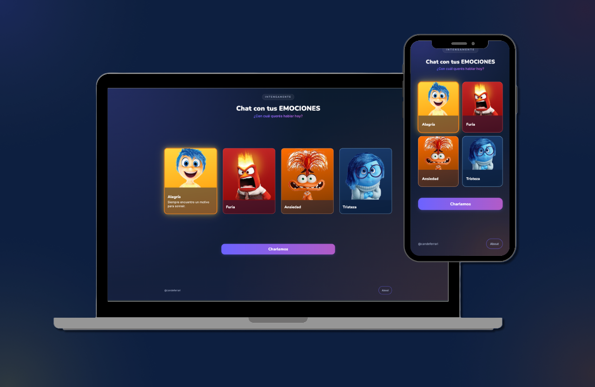
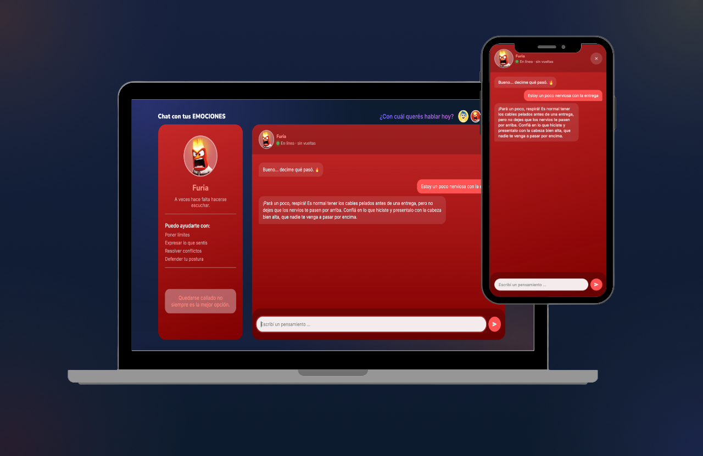
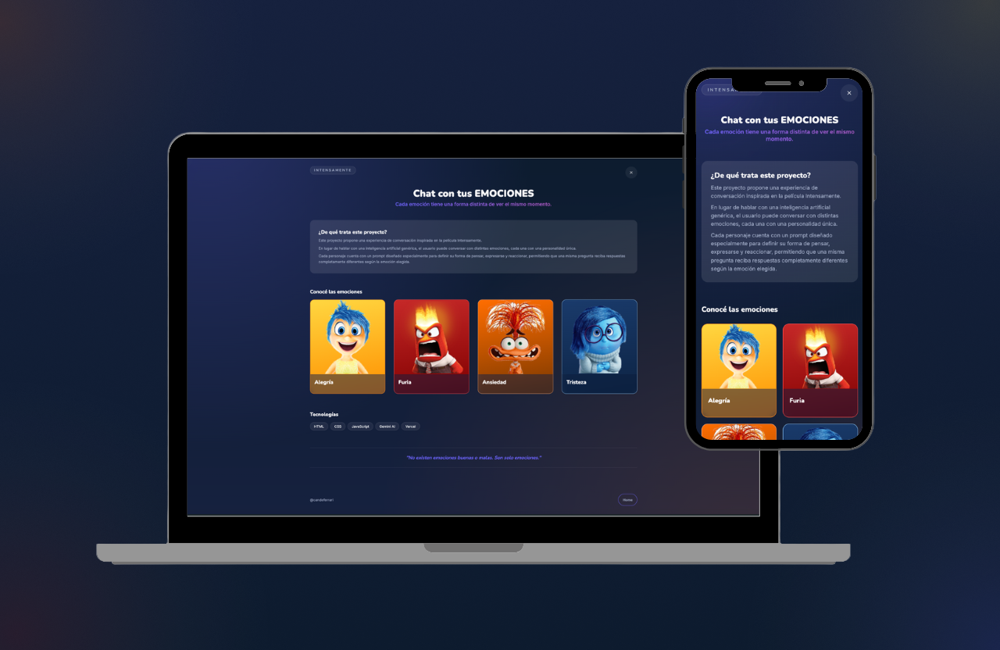
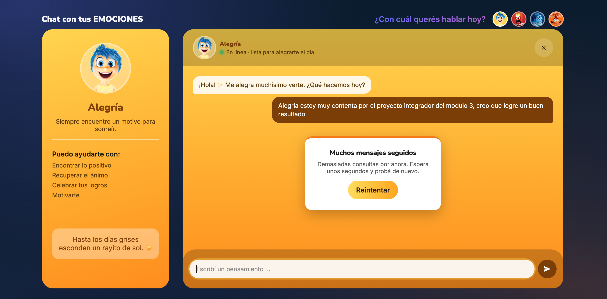

# 🎭 Chat con tus Emociones


> ¿Alguna vez te imaginaste poder hablar con Alegría, Tristeza, Furia o Ansiedad?

Este proyecto es una SPA en JavaScript vanilla (sin frameworks) inspirada en *Intensamente* (Pixar), donde podés chatear con Alegría, Furia, Tristeza y Ansiedad, cada una con su propia personalidad, potenciada por Google Gemini AI.
La idea no era crear un chatbot cualquiera, sino lograr que una misma pregunta recibiera respuestas completamente distintas según la emoción elegida.

Proyecto Integrador 3 — Soy Henry, Módulo 3 (Fullstack).

**🔗 Demo en vivo:** https://proyecto-m3-candelaria-ferrari.vercel.app/

---

## Índice
- [¿Por qué este proyecto?](#por-qué-este-proyecto)
- [Los personajes](#los-personajes)
- [Stack y arquitectura](#stack-y-arquitectura)
- [Estructura del proyecto](#estructura-del-proyecto)
- [Correrlo en local](#correrlo-en-local)
- [Tests](#tests)
- [Deploy](#deploy)
- [Funcionalidades](#funcionalidades)
- [Capturas](#capturas)
- [Uso de IA en el desarrollo](#uso-de-ia-como-herramienta-de-desarrollo)
- [Sobre este proyecto](#sobre-este-proyecto)


---

## 💡 ¿Por qué este proyecto?

Elegí inspirarme en *Intensamente* porque cada emoción tiene una personalidad muy marcada. Esto me permitió trabajar el diseño de prompts para que la inteligencia artificial no respondiera siempre igual, sino que reaccionara como lo haría cada personaje de la película. También me ayudo a poder marcar bien el diseño de cada uno de ellos, pudiendo elegir una paleta de colores para cada uno y así generar una interfaz bien marcada. 

El objetivo fue construir una experiencia donde el usuario realmente sienta que está conversando con las emociones de Riley y no simplemente con un asistente virtual.

---

## Los personajes

| Personaje | Personalidad | Te ayuda con |
|---|---|---|
| 😊 **Alegría** | Optimista, espontánea, siempre busca la luz incluso en momentos difíciles | Encontrar lo positivo, recuperar el ánimo, celebrar tus logros |
| 😡 **Furia** | Directa, impulsiva, odia las injusticias, pero nunca agresiva con quien le habla | Poner límites, expresar lo que sentís, resolver conflictos |
| 😢 **Tristeza** | Empática, tranquila, escucha antes de responder, no fuerza mensajes positivos | Hablar de lo que sentís, encontrar contención, procesar emociones |
| 😰 **Ansiedad** | Piensa varios pasos adelante, imagina escenarios posibles, a veces se acelera | Organizar ideas, prepararte para desafíos, reducir la incertidumbre |

Cada personaje tiene su propio *system prompt* (definido en `api/functions.js`) que le da personalidad, tono de voz y límites de conversación — incluyendo una salvedad para situaciones de riesgo real (autolesión, crisis), donde el personaje deja el rol de lado y recomienda buscar ayuda profesional.

## Stack y arquitectura

- **Frontend:** HTML, CSS y JavaScript vanilla (sin frameworks ni librerías de UI). Diseño mobile-first con Flexbox/Grid y media queries.
- **CSS modular:** los estilos están separados por responsabilidad (`base`, `shared` y un archivo por vista). Esto mantiene cada archivo pequeño, facilita encontrar las clases rápidamente y hace más simple el mantenimiento del proyecto.
- **Routing:** SPA con History API (`pushState` + evento `popstate`), sin recargar la página.
- **Estado del chat:** historial en memoria (un `Map` por personaje), vive solo durante la sesión — se pierde al recargar, tal como pide la consigna.
- **IA:** Google Gemini (Interactions API, modelo `gemini-3.5-flash`), consumida vía `fetch` nativo desde una Vercel Serverless Function — la API key nunca se expone al navegador.
- **Tests:** Vitest, sobre las funciones puras (utilitarias, parseo de la respuesta de la API, clasificación de errores).
- **Deploy:** Vercel, con deploy automático en cada `git push` a `main`.

## Estructura del proyecto

```
├── index.html            # entry point (en la raíz: lo requiere Vercel)
├── styles/               # base.css, shared.css, home.css, chatbox.css, about.css
├── assets/img/           # avatares de los 4 personajes
├── src/
│   ├── main.js           # arranca el router y la navegación
│   ├── router.js         # matching de rutas + history API
│   ├── navigation.js     # intercepta clicks en <a> para navegar sin recargar
│   ├── chat.js           # estado del chat, fetch a /api/functions, errores
│   ├── utils.js          # funciones puras (escapeHtml, createMessage)
│   └── views/            # home.js, chatbox.js, about.js, notFound.js
├── api/
│   └── functions.js      # serverless function: proxy hacia Gemini
├── test/
│   ├── utils.test.js
│   └── app.test.js
├── vercel.json           # rewrites (SPA fallback + /api passthrough)
└── vitest.config.js
```

## Correrlo en local

Necesitás Node.js instalado (con eso ya tenés `npm`).

```bash
# 1. Clonar el repo
git clone https://github.com/candelariaferrari/ProyectoM3_CandelariaFerrari.git
cd ProyectoM3_CandelariaFerrari

# 2. Instalar dependencias
npm install

# 3. Instalar la CLI de Vercel (una sola vez, global)
npm install -g vercel

# 4. Crear tu .env con tu propia API key de Gemini
cp .env.example .env
# y completar GEMINI_API_KEY=tu-key (conseguila gratis en https://aistudio.google.com/apikey)

# 5. Levantar el server local
vercel dev
```

Importante: **no uses Live Server** (ni ningún servidor estático simple) para probar el routing — no sabe aplicar el rewrite de SPA que necesita esta app, y vas a ver errores "Cannot GET /..." al navegar o recargar. `vercel dev` sí respeta `vercel.json` y simula el comportamiento real de producción.

## Tests

```bash
npm test          # corre todos los tests una vez
npm run test:watch  # los re-corre en cada cambio
```

Cubre: `escapeHtml` y `createMessage` (funciones utilitarias puras), `extractText` (parseo de la respuesta de la API de Gemini) y `errorInfoFor` (clasificación de errores para la tarjeta de error del chat).

## Deploy

El proyecto está conectado a Vercel vía Git: cada `git push` a `main` dispara un deploy automático a producción.

Para deployarlo desde cero en tu propia cuenta:

1. Importá el repo en [vercel.com/new](https://vercel.com/new).
2. En **Settings → Environment Variables**, agregá `GEMINI_API_KEY` con tu key, marcada para Production/Preview/Development.
3. Deployá (o esperá el primer push).


## ✨ Funcionalidades

- Navegación SPA sin recargar la página.
- Chat con cuatro emociones diferentes.
- Cada personaje tiene su propio system prompt.
- Historial independiente para cada emoción durante la sesión.
- Indicador de "escribiendo...".
- Manejo de errores de la API.
- Scroll automático.
- Responsive (mobile, tablet y desktop).
- API Key protegida mediante Vercel Functions.

## 📷 Capturas

### Home



---

### Chat



---

### About



---

### Errors



## 🤖 Uso de IA como herramienta de desarrollo
Durante el desarrollo utilicé Claude como herramienta de apoyo y pair-programming. En lugar de pedir código para copiar, lo usé para entender distintas alternativas de implementación, investigar documentación actualizada y comprender el porqué de cada decisión técnica antes de incorporarla al proyecto. 

Algunas decisiones concretas que salieron de ese proceso:
- **Arquitectura y estructura de carpetas:** le compartí la guía del proyecto y un ejemplo del profesor para decidir cómo organizar `src/`, `api/` y los estilos, y entender por qué `index.html` tiene que vivir en la raíz para que Vercel lo sirva bien en producción.
- **Integración con Gemini:** le pedí que investigara el estado actual de la API de Gemini (cambió de formato de API key y de endpoint —de `generateContent` a la Interactions API— durante 2026), para no basar el código en documentación vieja.
- **System prompts de los personajes:** partimos de una versión base y los fui iterando a mano (agregando ejemplos de diálogo, ajustando el tono de cada uno) hasta que las respuestas sonaban realmente como cada personaje.
- **Debugging de CSS:** un bug de scroll (la página entera scrolleaba en vez de quedar contenido dentro del chat) llevó varias iteraciones — terminó siendo un problema real de Flexbox (`min-height` vs `height` fija, y falta de `overflow: hidden` en el punto justo de la cadena de contenedores).
- **Tests:** me ayudó a identificar qué funciones eran las más importantes de testear (las puras: `escapeHtml`, `createMessage`, el parseo de la respuesta de la API) y por qué esas y no la lógica que toca el DOM directamente.

---

## 👩‍💻 Sobre este proyecto

Este proyecto fue desarrollado como entrega del **Proyecto Integrador del Módulo 3** de Soy Henry.

Además de cumplir con los requisitos de la consigna, busqué aprovecharlo para practicar buenas prácticas de organización del código, diseño responsive, consumo seguro de APIs mediante Serverless Functions y creación de prompts para inteligencia artificial.

Si te gustó el proyecto o tenés alguna sugerencia, ¡estaré encantada de leerla!

Candelaria Ferrari.
