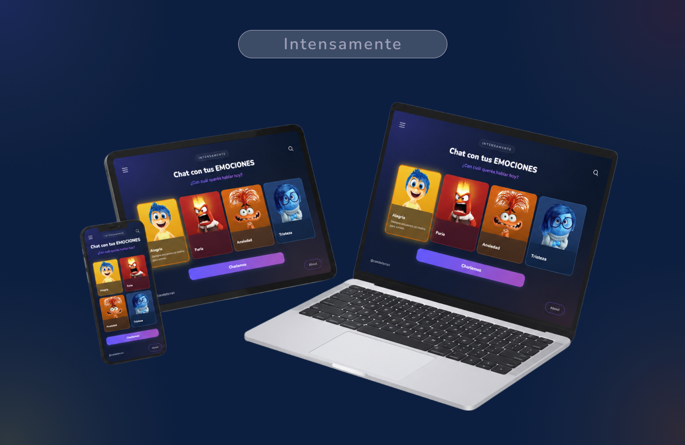
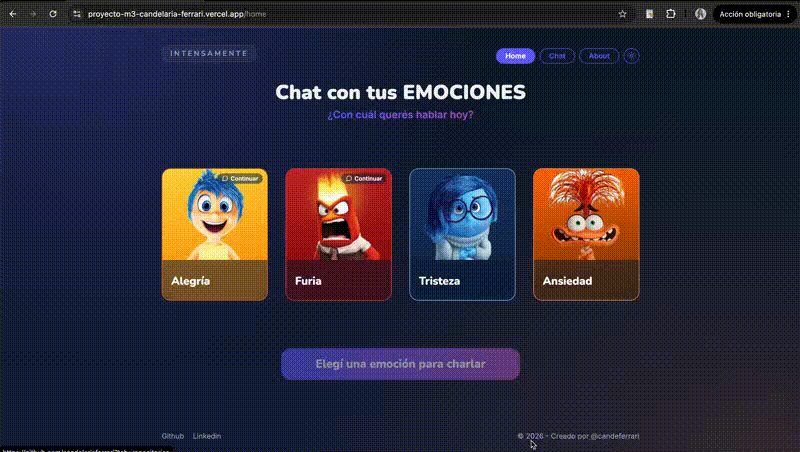
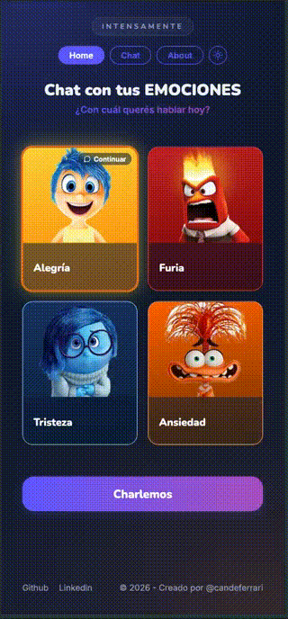
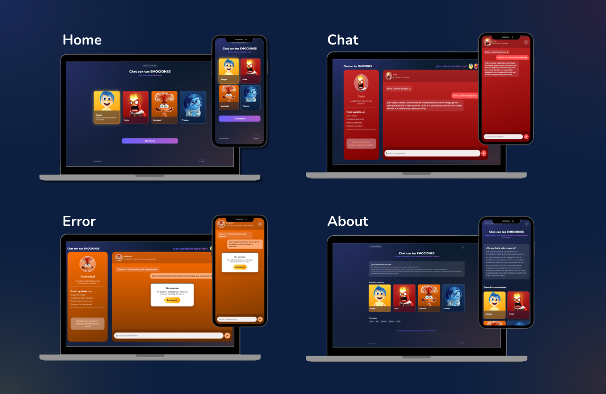

# 🎭 Chat con tus Emociones


> ¿Alguna vez te imaginaste poder hablar con Alegría, Tristeza, Furia o Ansiedad?

Este proyecto es una SPA en JavaScript vanilla (sin frameworks) inspirada en *Intensamente* (Pixar), donde podés chatear con Alegría, Furia, Tristeza y Ansiedad, cada una con su propia personalidad, potenciada por Google Gemini AI.
La idea no era crear un chatbot cualquiera, sino lograr que una misma pregunta recibiera respuestas completamente distintas según la emoción elegida.

Proyecto Integrador 3 — Soy Henry, Módulo 3 (Fullstack).

**🔗 Demo en vivo:** https://proyecto-m3-candelaria-ferrari.vercel.app/


---

## Índice
- [¿Por qué este proyecto?](#por-qué-este-proyecto)
- [Los personajes](#los-personajes)
- [Stack y arquitectura](#stack-y-arquitectura)
- [Estructura del proyecto](#estructura-del-proyecto)
- [Correrlo en local](#correrlo-en-local)
- [Cómo consumir la API](#cómo-consumir-la-api)
- [Tests](#tests)
- [Deploy](#deploy)
- [Funcionalidades](#funcionalidades)
- [Demo](#-demo)
- [Capturas](#capturas)
- [Uso de IA en el desarrollo](#uso-de-ia-como-herramienta-de-desarrollo)
- [Sobre este proyecto](#sobre-este-proyecto)


---

## 💡 ¿Por qué este proyecto?

Elegí inspirarme en *Intensamente* porque cada emoción tiene una personalidad muy marcada. Esto me permitió trabajar el diseño de prompts para que la inteligencia artificial no respondiera siempre igual, sino que reaccionara como lo haría cada personaje de la película. También me ayudo a poder marcar bien el diseño de cada uno de ellos, pudiendo elegir una paleta de colores para cada uno y así generar una interfaz bien marcada. 

El objetivo fue construir una experiencia donde el usuario realmente sienta que está conversando con las emociones de Riley y no simplemente con un asistente virtual.

---

## Los personajes

| Personaje | Personalidad | Te ayuda con |
|---|---|---|
| 😊 **Alegría** | Optimista, espontánea, siempre busca la luz incluso en momentos difíciles | Encontrar lo positivo, recuperar el ánimo, celebrar tus logros |
| 😡 **Furia** | Directa, impulsiva, odia las injusticias, pero nunca agresiva con quien le habla | Poner límites, expresar lo que sentís, resolver conflictos |
| 😢 **Tristeza** | Empática, tranquila, escucha antes de responder, no fuerza mensajes positivos | Hablar de lo que sentís, encontrar contención, procesar emociones |
| 😰 **Ansiedad** | Piensa varios pasos adelante, imagina escenarios posibles, a veces se acelera | Organizar ideas, prepararte para desafíos, reducir la incertidumbre |

Cada personaje tiene su propio *system prompt* (definido en `api/functions.js`) que le da personalidad, tono de voz y límites de conversación — incluyendo una salvedad para situaciones de riesgo real (autolesión, crisis), donde el personaje deja el rol de lado y recomienda buscar ayuda profesional.

## Stack y arquitectura

- **Frontend:** HTML, CSS y JavaScript vanilla (sin frameworks ni librerías de UI). Diseño mobile-first con Flexbox/Grid y media queries.
- **CSS modular:** los estilos están separados por responsabilidad (`base`, `shared` y un archivo por vista). Esto mantiene cada archivo pequeño, facilita encontrar las clases rápidamente y hace más simple el mantenimiento del proyecto.
- **Routing:** SPA con History API (`pushState` + evento `popstate`), sin recargar la página.
- **Estado del chat:** historial en memoria (un `Map` por personaje), vive solo durante la sesión — se pierde al recargar, tal como pide la consigna. Se puede reiniciar manualmente con el botón de reset del chat.
- **IA:** Google Gemini (Interactions API, modelo `gemini-3.1-flash-lite`), consumida vía `fetch` nativo desde una Vercel Serverless Function — la API key nunca se expone al navegador. En cada request se manda el historial completo (recortado a los últimos 20 mensajes) para que el personaje mantenga contexto de la conversación.
- **Tests:** Vitest, sobre las funciones puras (utilitarias, parseo de la respuesta de la API, clasificación de errores).
- **Deploy:** Vercel, con deploy automático en cada `git push` a `main`.

## Estructura del proyecto

```
├── index.html            # entry point (en la raíz: lo requiere Vercel)
├── styles/               # los CSS, separados por tema: base.css, shared.css, home.css, chatbox.css, about.css
├── assets                # avatares de los 4 personajes y capturas de pantalla.
├── src/
│   ├── main.js           # arranca el router y la navegación
│   ├── router.js         # matching de rutas + history API
│   ├── navigation.js     # intercepta clicks en <a> para navegar sin recargar
│   ├── chat.js           # toda la lógica del chat: estado del chat, fetch a /api/functions, errores
│   ├── storage.js        # persistencia del historial en localStorage
│   ├── theme.js          # preferencia de modo claro/oscuro (Home/About)
│   ├── emotions.js       # datos centralizados de las 4 emociones (nombre, descripción, prompts de ayuda, saludo, frase)
│   ├── utils.js          # funciones puras (escapeHtml, createMessage) reutilizables
│   └── views/            # una función por pantalla: home.js, chatbox.js, about.js, notFound.js, y shared.js (navbar/footer/toggle de tema compartidos por Home y About)
├── api/
│   ├── functions.js      # habla con Gemini sin exponer API key, serverless function: valida la petición HTTP
├── test/.                # los tests automáticos (Vitest)
│   ├── utils.test.js
│   ├── app.test.js
│   └── storage.test.js
├── vercel.json           # configuración para que Vercel sirva bien la SPA, rewrites (SPA fallback + /api passthrough)
└── vitest.config.js.     # configuración de los tests
```

## Correrlo en local

Necesitás Node.js instalado (con eso ya tenés `npm`).

```bash
# 1. Clonar el repo
git clone https://github.com/candelariaferrari/ProyectoM3_CandelariaFerrari.git
cd ProyectoM3_CandelariaFerrari

# 2. Instalar dependencias
npm install

# 3. Instalar la CLI de Vercel (una sola vez, global)
npm install -g vercel

# 4. Crear tu .env con tu propia API key de Gemini
cp .env.example .env
# y completar GEMINI_API_KEY=tu-key (conseguila gratis en https://aistudio.google.com/apikey)

# 5. Levantar el server local
vercel dev
```

Importante: **no uses Live Server** (ni ningún servidor estático simple) para probar el routing — no sabe aplicar el rewrite de SPA que necesita esta app, y vas a ver errores "Cannot GET /..." al navegar o recargar. `vercel dev` sí respeta `vercel.json` y simula el comportamiento real de producción.

## Cómo consumir la API

El frontend nunca habla con Gemini directamente: le habla a nuestra propia Serverless Function (`api/functions.js`), que es la única que conoce la API key. Esto es lo que hay que mandarle y lo que devuelve.

**Endpoint:** `POST /api/functions`

**Body de la petición:**

```json
{
  "character": "joy",
  "messages": [
    { "id": "...", "role": "user", "text": "Hola, ¿cómo estás?" },
    { "id": "...", "role": "assistant", "text": "¡Hola! ✨ Me alegra muchísimo verte." },
    { "id": "...", "role": "user", "text": "Me llamo Cande" }
  ]
}
```

- `character`: uno de `joy`, `anger`, `sadness`, `anxiety` — define qué *system prompt* (personalidad) se usa.
- `messages`: el historial **completo** de la conversación hasta ese momento, no solo el último mensaje. Esto es clave: Gemini no guarda memoria entre peticiones por su cuenta (cada llamada a la API es independiente), así que si no mandáramos todo el historial, el personaje "olvidaría" todo lo hablado antes. Por eso `chat.js` guarda la conversación en memoria y se la reenvía entera en cada mensaje nuevo.

**Respuesta exitosa (200):**

```json
{ "text": "¡Encantada, Cande! ✨ ¿En qué te puedo ayudar hoy?" }
```

**Respuestas de error:**

| Status | Cuándo pasa |
|---|---|
| 400 | Falta el historial o el personaje no es válido |
| 405 | Se llamó con un método distinto a `POST` |
| 429 | Se superó el límite de peticiones por minuto del tier gratuito de Gemini |
| 500 / 502 | Falta la API key configurada, o Gemini no pudo generar una respuesta |

Ejemplo con `fetch` (así lo consume `chat.js`):

```js
const response = await fetch("/api/functions", {
  method: "POST",
  headers: { "Content-Type": "application/json" },
  body: JSON.stringify({ character: "joy", messages: conversation }),
});
const data = await response.json();
```

**Cómo probar que el personaje "recuerda" la conversación:** entrá a cualquier chat, contale algo personal (por ejemplo "me llamo Cande" o "hoy rendí un examen"), seguí charlando un par de mensajes más, y después preguntale directamente por ese dato (por ejemplo "¿cómo me llamo?"). Si responde bien, es porque el historial completo se está mandando y usando correctamente en cada request — se puede confirmar además mirando el *payload* que se manda a Gemini en los logs de Vercel (`console.error` solo loguea errores, pero se puede agregar un `console.log(transcript)` temporal en `api/functions.js` para verlo).

## Tests

```bash
npm test          # corre todos los tests una vez
npm run test:watch  # los re-corre en cada cambio
```

Son 18 tests en total. La mayoría son sobre funciones puras del proyecto (las que no dependen del DOM ni de una llamada real a la API — reciben un dato y siempre devuelven el mismo resultado, así que no hace falta mockear nada). Los de `storage.js` sí necesitan un mock, porque esas funciones sí dependen de algo externo (`localStorage`, que en el entorno de test de Node no existe de verdad): se reemplaza por un `localStorage` falso en memoria (`vi.stubGlobal` + `vi.fn()`), para poder probar el comportamiento sin depender de un navegador.

```bash
  ✓ test/app.test.js (6)
   ✓ extractText (parseo de la respuesta de Gemini) (3)
     ✓ extrae el texto de una respuesta válida de Gemini
     ✓ devuelve "" si la respuesta no trae ningún step de tipo model_output
     ✓ devuelve "" si "steps" directamente no viene en la respuesta
   ✓ errorInfoFor (mapeo de errores a la tarjeta de error del chat) (3)
     ✓ clasifica un status 429 como rate-limit
     ✓ clasifica cualquier otro status HTTP como error de servidor
     ✓ clasifica un error sin status (fetch que nunca respondió) como error de red
  ✓ test/storage.test.js (7)
   ✓ storage.js (persistencia del historial en localStorage) (7)
     ✓ guarda una conversación y después la lee igual
     ✓ devuelve null si no hay nada guardado para ese personaje
     ✓ borra la conversación guardada
     ✓ hasSavedConversation es false cuando solo está el saludo inicial (1 mensaje)
     ✓ hasSavedConversation es true si ya se habló más allá del saludo
     ✓ guarda con la clave con el prefijo correcto (mismo prefijo que usa chat.js)
     ✓ no rompe si localStorage.getItem tira un error (ej: modo privado)
  ✓ test/utils.test.js (5)
   ✓ escapeHtml (3)
     ✓ escapa los 5 caracteres especiales de HTML
     ✓ no modifica un texto que no tiene caracteres especiales
     ✓ convierte a string cualquier valor que no sea string (ej: number)
   ✓ createMessage (2)
     ✓ crea un mensaje con la forma { id, role, text }
     ✓ genera un id distinto en cada llamada, incluso con el mismo texto
```

## Deploy

El proyecto está conectado a Vercel vía Git: cada `git push` a `main` dispara un deploy automático a producción.

Para deployarlo desde cero en tu propia cuenta:

1. Importá el repo en [vercel.com/new](https://vercel.com/new).
2. En **Settings → Environment Variables**, agregá `GEMINI_API_KEY` con tu key, marcada para Production/Preview/Development.
3. Deployá (o esperá el primer push).


## ✨ Funcionalidades

- Navegación SPA sin recargar la página.
- Navbar con indicador de la página activa (Home / Chat / About), responsive.
- Chat con cuatro emociones diferentes.
- Cada personaje tiene su propio system prompt.
- Historial independiente para cada emoción durante la sesión (recortado a los últimos 20 mensajes al mandarlo a Gemini).
- Botón para reiniciar la conversación con un personaje.
- Los "dots" para cambiar de personaje muestran primero al que está activo, con diferenciación visual clara.
- Scroll del chat estilizado con el color de acento de cada personaje.
- Indicador de "escribiendo...".
- Manejo de errores de la API, con cooldown para evitar el rate-limit del tier gratuito.
- Scroll automático.
- Responsive (mobile, tablet y desktop).
- API Key protegida mediante Vercel Functions.
- Persistencia con localStorage
- Copiar respuesta a portapapeles
- Modo claro/oscuro

## 🎬 Demo

Por si al momento de la corrección la API de Gemini está saturada o se acabó la cuota gratuita del token, estos GIFs muestran el proyecto funcionando de punta a punta (navegación, chat con Gemini respondiendo, y modo claro/oscuro).

**Desktop:**



**Mobile:**



## 📷 Capturas

### Presentación de vistas



---


## 🤖 Uso de IA como herramienta de desarrollo
Durante el desarrollo utilicé Claude como herramienta de apoyo y pair-programming. En lugar de pedir código para copiar, lo usé para entender distintas alternativas de implementación, investigar documentación actualizada y comprender el porqué de cada decisión técnica antes de incorporarla al proyecto. 

Algunas decisiones concretas que salieron de ese proceso:
- **Arquitectura y estructura de carpetas:** le compartí la guía del proyecto y un ejemplo del profesor para decidir cómo organizar `src/`, `api/` y los estilos, y entender por qué `index.html` tiene que vivir en la raíz para que Vercel lo sirva bien en producción.
- **Integración con Gemini:** le pedí que investigara el estado actual de la API de Gemini (cambió de formato de API key y de endpoint —de `generateContent` a la Interactions API— durante 2026), para no basar el código en documentación vieja.
- **System prompts de los personajes:** partimos de una versión base y los fui iterando a mano (agregando ejemplos de diálogo, ajustando el tono de cada uno) hasta que las respuestas sonaban realmente como cada personaje.
- **Debugging de CSS:** un bug de scroll (la página entera scrolleaba en vez de quedar contenido dentro del chat) llevó varias iteraciones — terminó siendo un problema real de Flexbox (`min-height` vs `height` fija, y falta de `overflow: hidden` en el punto justo de la cadena de contenedores).
- **Tests:** me ayudó a identificar qué funciones eran las más importantes de testear (las puras: `escapeHtml`, `createMessage`, el parseo de la respuesta de la API) y por qué esas y no la lógica que toca el DOM directamente.
- **Test de `storage.js` con mock:** como `localStorage` no existe en el entorno de test (Vitest corre en Node, no en un navegador), me explicó qué es mockear y me ayudó a armar un `localStorage` falso en memoria con `vi.fn()` y `vi.stubGlobal()`, para poder probar el guardado/lectura/borrado del historial y el manejo de errores (ej: modo privado) sin depender de un browser real.
- **Decisiones de UX/UI:** en varias mejoras de interfaz (por ejemplo, cómo resolver el navbar en mobile sin agregar un menú hamburguesa innecesario para solo 3 links, o cómo diferenciar visualmente qué personaje está activo) discutí con la IA distintas alternativas y sus tradeoffs antes de elegir una, en vez de pedir directamente una solución armada.
- **Persistencia con localStorage:** me ayudó a pensar el diseño antes de escribir código (por qué conviene mantener un `Map` en memoria como caché y no leer `localStorage` en cada render, cómo envolver las llamadas a `localStorage` en `try/catch` para que no rompan la app en modo privado o si el storage está lleno/deshabilitado, y por qué mutar el array de la conversación en vez de reemplazarlo al reiniciar el chat).


---

## 👩‍💻 Sobre este proyecto

Este proyecto fue desarrollado como entrega del **Proyecto Integrador del Módulo 3** de Soy Henry.

Además de cumplir con los requisitos de la consigna, busqué aprovecharlo para practicar buenas prácticas de organización del código, diseño responsive, consumo seguro de APIs mediante Serverless Functions y creación de prompts para inteligencia artificial.

Si te gustó el proyecto o tenés alguna sugerencia, ¡estaré encantada de leerla!

Candelaria Ferrari.
